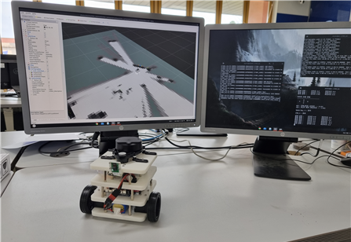
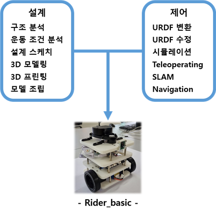

# ROS 2를 이용한 자율주행로봇 설계 및 제어

## 프로젝트 목적
* 주행로봇 직접 설계
* ROS 2 패키지를 이용하여 시뮬레이션 및 제어

## 개발 환경

- 운영체제 : Ubuntu Desktop 20.04 LTS (Linux)
- IDE :  Visual Studio Code
- 사용언어 : Python
- 3D 설계 : Solid Works
- 3D 프린팅 설정 : Ultimaker Cura

## 수행요소

